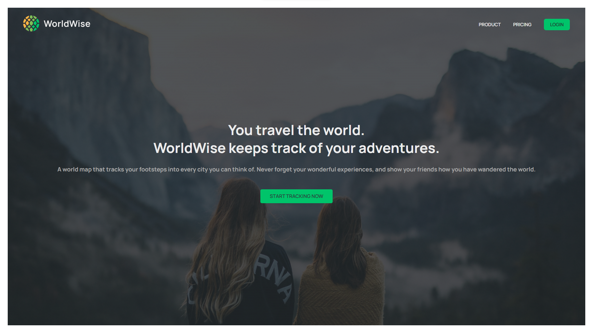

  

---

# Worldwise (Practice Application)

## Description



This practice application has been created to practice advanced React concepts such as: React Hooks, custom React Hooks, React Router, React Context API, React Lazy Component Load, Global State using Url, modern React file structure, React performance optimization (using Chrome extension: React Component Tree and React Profiler) and more.. It is built using Vite compiler. 

This application allows user to locate cities, using OpenStreetMap API, and track cities user has visited along with dates visited and notes. This application is a practice application and does not have a real database; instead, it uses local server to fetch data. All data is stored locally. Please see installation section below for more details. After installation, to start the application, please run the following command in your terminal:

```bash
npm run dev
```

---

## Table of Contents

- [Installation](#installation)
- [Usage](#usage)
- [Credits](#credits)
- [Contributing](#contributing)
- [Tests](#tests)
- [Questions](#questions)

---

## Installation

You will have to run this program in your terminal.

To install necessary dependencies, run the following command:

```bash
npm i
```

---

## Usage

ATTENTION: The application relies on local server for fetching data. You will need to open a separate (different) terminal that is specific for the local server and run the following command:

```bash
npm run server
```

You should leave this server terminal opened while using the application.

Once after you've installed dependencies and opened your local server, run the application with the following command in your terminal (one that's not running the server):

```bash
npm run dev
```

If you've followed the steps correctly, you will be able to use the application by opening a browser and going to http://localhost:5173

---

## Credits

Thank you, Jonas Schmedtmann, for providing amazing CSS styles, reuseable React components, React guides and instructions!

---

## Contributing

For contributions, please create a new branch of the project and submit a pull request. Any contributions are greatly appreciated. Issues can be submitted in the issues section of the repo or by emailing me directly (see Questions section below).

---

## Tests

Test feature is not available at this time.

---

## Questions

If you have any questions about the repo, open an issue or contact me directly at:

Github: [jyoungjoon](https://github.com/jyoungjoon)

Email: lifescriptified@gmail.com

---
